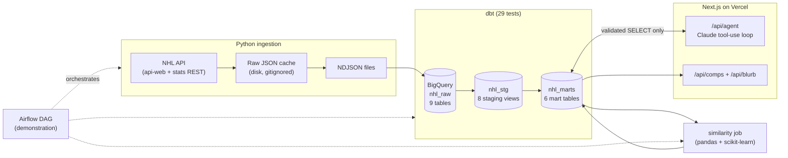

# Hockey Research Agent

A miniature hockey R&D data platform: a real pipeline from the public NHL API into BigQuery, dbt transformations with tests, and a Claude-powered research agent on top, deployed as a Next.js app on Vercel.

**Live demo:** https://hockey-research-agent.vercel.app

Two core features:

1. **Research Agent**: ask natural-language hockey questions. Claude translates the question to SQL, executes it against the BigQuery warehouse via tool use, self-corrects on errors, and answers with the supporting data table and the exact SQL it ran (transparency toggle in the UI).
2. **Player Similarity Engine**: search any NHL skater (typeahead on first or last name) and get their 10 most statistically similar players, with a side-by-side stat comparison and an AI-generated scouting-style blurb explaining the comparison.

<!-- screenshot: research agent answering the PK question -->
<!-- screenshot: player comps for Cale Makar with scouting blurb -->

## Architecture



Daily orchestration is documented as a demonstration Airflow DAG ([airflow/dags/nhl_daily_ingest.py](airflow/dags/nhl_daily_ingest.py)): parallel ingest branches fan into the BigQuery load, dbt tests gate the similarity rebuild.

## Stack rationale

| Choice | Why |
|---|---|
| **BigQuery** | Serverless columnar warehouse; the free tier easily covers this volume (~6K rows). Datasets separate concerns: `nhl_raw` (landed payloads), `nhl_stg` (views), `nhl_marts` (query surface). |
| **dbt-core** | Transformations as versioned, tested SQL. Staging views handle renames/casts/dedupe; marts are documented tables the agent can query. Tests caught a real bug (see below). |
| **Claude tool use over embeddings/RAG** | The data is structured and relational. Text-to-SQL against a documented schema gives exact answers with full transparency (you see the SQL). Embeddings would blur questions like "PK% over the last 15 games" that need precise aggregation. RAG belongs on unstructured data (scouting reports), not stat tables. |
| **Raw JSON cache + NDJSON** | Every API response is cached to disk, so re-runs never re-hit the NHL's undocumented API. NDJSON is BigQuery's native batch format. |
| **Airflow (demonstration)** | The team's orchestrator. One DAG file documents the daily task graph without requiring a running scheduler for a portfolio repo. |
| **Next.js + Vercel** | Server-side API routes keep the Anthropic key and BigQuery service account off the client. Serverless deploys free. |
| **cosine similarity on z-scored per-game stats** | Interpretable, position-aware player comps without training data. Per-game rates make 60-game players comparable to 82-game players; z-scoring stops high-variance stats (hits) from dominating low-variance ones (shooting %). |

## Data

Two complete NHL regular seasons: **2025-26** (primary) and **2024-25** (comparison).

- League-wide: skater season summaries (plus the realtime report for hits/blocks), goalie summaries, team summaries, standings.
- Game-grain: all 82 Pittsburgh Penguins 2025-26 games (score, opponent, special teams for/against, shots, hits, blocks), enabling questions like "last 15 games" and "which opponents hurt the PK most".

### Data quality, verified two ways

- **29 dbt tests**: unique/not-null keys, accepted values on position groups and game results, and a sanity test that PIT has exactly 82 game rows.
- **Cross-source validation**: PIT's season PP% and PK% computed from the 82 individual game rows (24.14% / 81.43%) match the NHL's own season-summary endpoint (24.1379% / 81.4346%) to four decimals. Two independent API surfaces, one consistent warehouse.
- **A test that caught a real bug**: the NHL assigned Utah a new `teamId` when the franchise rebranded from Utah Hockey Club (id 59) to Utah Mammoth (id 68), same `UTA` tricode. The `unique tri_code` test on `dim_teams` failed with 33 rows for 32 franchises; the fix re-grained the dimension to one row per active franchise and resolves historical seasons through the full team reference.

## Agent design and guardrails

Only Claude writes SQL, and every statement passes validation before execution ([web/lib/bigquery.ts](web/lib/bigquery.ts)):

- Single statement, `SELECT`/`WITH` only, no semicolons
- Blocklist of DDL/DML keywords (INSERT, UPDATE, DELETE, DROP, CREATE, ...)
- `nhl_marts` tables only; `nhl_raw`, `nhl_stg`, and `INFORMATION_SCHEMA` are rejected
- `LIMIT 200` injected when absent; 15s job timeout; bytes-billed cap
- User text is never interpolated into SQL anywhere in the app; UI lookups (player search) use BigQuery query parameters

The system prompt is built from a schema document ([web/lib/schema.ts](web/lib/schema.ts)): every mart table with columns, types, and one-line descriptions, plus four example question-to-SQL pairs. On a BigQuery error the message is fed back to Claude, which retries with corrected SQL (max 3 attempts). The response returns the answer, every executed query, and the last result set, so the UI can show its work.

## Example questions

- "How has Pittsburgh's penalty kill performed over the last 15 games, and which opponents scored the most power play goals against them?"
- "Who led the league in points per game among players with at least 50 games this season?"
- "Which teams improved their power play the most from 2024-25 to 2025-26?"
- "Which defensemen blocked the most shots per game?"

## Setup

Prereqs: Python 3.12 (dbt is not yet compatible with 3.14), Node 20+, a GCP project with BigQuery enabled, an Anthropic API key.

```bash
# 1. Python environment
python -m venv .venv && .venv/Scripts/activate   # or source .venv/bin/activate
pip install -r requirements.txt

# 2. GCP: service account with BigQuery Data Editor + Job User roles,
#    key saved as ./gcp-sa.json (gitignored), then:
bq --location=US mk -d nhl_raw && bq --location=US mk -d nhl_stg && bq --location=US mk -d nhl_marts

# 3. Configure
cp .env.example .env                      # fill in ANTHROPIC_API_KEY, GCP_PROJECT_ID
cp dbt/profiles.yml.example dbt/profiles.yml   # point keyfile/project at yours

# 4. Pipeline (each step is idempotent; API pulls are cached)
python ingestion/ingest_reference.py
python ingestion/ingest_season_stats.py
python ingestion/ingest_pens_games.py
python ingestion/load_to_bigquery.py
dbt run --project-dir dbt --profiles-dir dbt
dbt test --project-dir dbt --profiles-dir dbt
python similarity/compute_similarity.py

# 5. Web app
cd web && npm install
# .env.local: ANTHROPIC_API_KEY, GCP_PROJECT_ID, GOOGLE_APPLICATION_CREDENTIALS
npm run dev
```

Deploying to Vercel: set `ANTHROPIC_API_KEY`, `GCP_PROJECT_ID`, `BQ_DATASET_MARTS`, and `GCP_SERVICE_ACCOUNT_KEY` (the full service-account JSON as a single-line string; file paths do not exist in serverless). `web/lib/bigquery.ts` prefers the JSON string and falls back to the key file for local dev.

Tests: `pytest tests/` covers the API client (caching, retries) and the similarity engine (normalization, position-group isolation).

## What I'd build next with internal data

- **Tracking data ingestion**: land per-event puck/player tracking into partitioned raw tables, with staging models that sessionize shifts and derive zone entries; the same raw → staging → marts pattern scales to that volume with partition pruning.
- **Search over scouting notes**: Elasticsearch (or BigQuery vector search) over unstructured scouting reports, joined back to `dim_players` so the agent can answer "what did our scouts say about players statistically similar to X?"
- **RAG on unstructured reports**: retrieval over medical, development, and pro-scouting documents as a second agent tool alongside `run_sql`, letting one question combine structured stats with written evaluation.
- **Evaluation harness for agent SQL accuracy**: a golden set of question/answer pairs replayed against every schema or prompt change, scoring SQL correctness and answer faithfulness, so the agent's accuracy is a tested, versioned artifact like the dbt models.

## Disclaimer

Uses publicly available NHL API data. Not affiliated with or endorsed by the NHL or any team.
