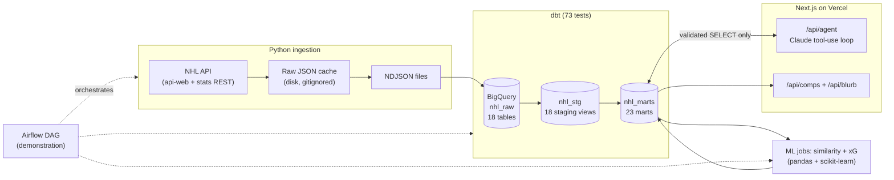

# Hockey Research Agent

A miniature hockey R&D data platform: a real pipeline from the public NHL API into BigQuery, dbt transformations with tests, and a Claude-powered research agent on top, deployed as a Next.js app on Vercel.

**Live demo:** https://hockey-research-agent.vercel.app

Two core features:

1. **Research Agent**: ask natural-language hockey questions in a multi-turn conversation. Claude translates each question to SQL, executes it against the BigQuery warehouse via tool use, self-corrects on errors, and streams the answer with the supporting data table and the exact SQL it ran (transparency toggle in the UI). A golden-set evaluation harness replays 23 assertion-checked questions, including adversarial ones, against every prompt or schema change.
2. **Player Similarity Engine**: search any NHL skater or goalie (typeahead on first or last name) and get their closest statistical comps: TOI-honest per-60 profiles blended with the prior season, three scout-selectable weight profiles (overall / offense / physical), league percentile ranks on every stat, an age filter, and an AI-generated scouting-style blurb. Visual scouting card included: a percentile radar overlay and side-by-side xG shot maps.
3. **Leaders + visuals**: a league leaderboards page (scoring, xG volume, finishing above expected, save %, team xG share, hottest closers) rendered as bar charts, and agent answers auto-chart when the result is a time series or ranking (line/bar with a metric picker). All charts are hand-rolled SVG; no chart library.

<!-- screenshot: research agent answering the PK question -->
<!-- screenshot: player comps for Cale Makar with scouting blurb -->

## Architecture



Daily orchestration is documented as a demonstration Airflow DAG ([airflow/dags/nhl_daily_ingest.py](airflow/dags/nhl_daily_ingest.py)): parallel ingest branches fan into the BigQuery load; dbt tests gate the ML jobs, and the xG marts build behind their own calibration test.

## Stack rationale

| Choice | Why |
|---|---|
| **BigQuery** | Serverless columnar warehouse; the free tier easily covers this volume (~6K rows). Datasets separate concerns: `nhl_raw` (landed payloads), `nhl_stg` (views), `nhl_marts` (query surface). |
| **dbt-core** | Transformations as versioned, tested SQL. Staging views handle renames/casts/dedupe; marts are documented tables the agent can query. Tests caught a real bug (see below). |
| **Claude tool use over embeddings/RAG** | The data is structured and relational. Text-to-SQL against a documented schema gives exact answers with full transparency (you see the SQL). Embeddings would blur questions like "PK% over the last 15 games" that need precise aggregation. RAG belongs on unstructured data (scouting reports), not stat tables. |
| **Raw JSON cache + NDJSON** | Every API response is cached to disk, so re-runs never re-hit the NHL's undocumented API. NDJSON is BigQuery's native batch format. |
| **Airflow (demonstration)** | The team's orchestrator. One DAG file documents the daily task graph without requiring a running scheduler for a portfolio repo. |
| **Next.js + Vercel** | Server-side API routes keep the Anthropic key and BigQuery service account off the client. Serverless deploys free. |
| **cosine similarity on z-scored per-60 stats** | Interpretable, position-aware player comps without training data. Per-60 rates against the correct strength-state ice time separate production from opportunity; z-scoring stops high-variance stats (hits) from dominating low-variance ones (shooting %); blending 25% of the prior season damps single-season outliers; points is excluded from the vector because it double-counts goals + assists. |

## Data

**Every NHL season since 1917-18, regular season AND playoffs**, at season grain (47,644 regular + 21,312 playoff skater-seasons, plus goalies and teams), with **2025-26** as the primary season carrying full game, player-game, and shot grain for both the regular season and the complete playoff run to the Cup.

- Season grain, all history: skater summaries plus the realtime (hits/blocks), timeonice (EV/PP/SH ice time splits), and bios (birth dates, draft) reports; goalie summaries and bios; team summaries; standings. Career marts aggregate per player with era-honest rate stats.
- Era handling: stats that predate their tracking (shots before 1959-60, TOI before 1997-98, hits/blocks before the modern era) are null, never zero. The API returns false zeros for untracked realtime stats; staging nulls any stat whose league-wide season total is zero, so Gordie Howe has null career hits instead of a fabricated 0. Validated against the record book: Gretzky 2,857 points / 894 goals / 92-goal season, Brodeur 691 wins, all exact.
- Playoffs: playoff season and career marts across all history (kept strictly separate from regular-season tables so totals are never silently mixed), plus 2025-26 playoff game/player-game/shot grain with bracket round decoding, so "who won the Stanley Cup?" is a query, not a guess.
- Game grain (2025-26): all 1,312 regular-season games as `fct_team_games` (2,624 team-perspective rows with rest days and back-to-back flags), rolling 5/10/15-game special-teams form for every team, and `fct_player_games` game logs for every skater and goalie.
- Rolling player form: `mart_player_form` decomposes every skater's last-10 window into production, shot volume, and finishing vs expected (hot streak = real shooting heat or bounce luck).
- Shot grain: ~163K shot attempts (regular season + playoffs) parsed from play-by-play with geometry (distance/angle to the attacked net), strength state, and rebound/rush flags, scored by the xG model below.

### Expected goals model

A logistic regression over unblocked, goalie-in-net shot attempts: distance, angle, shot type, rebound (within 3s of a prior attempt), rush (within 4s of a neutral/defensive-zone event), and strength state. Holdout AUC and league calibration print at training time, and a dbt test fails the pipeline if league-wide predicted goals drift more than 5% from actual. Deliberately public-data honest: no screens, pre-shot movement, or shooter identity, and the agent is instructed to describe it as "expected goals from shot location and type." Outputs: shot-level `fct_shots.xg`, `mart_player_xg_season` (finishing above expected), `mart_team_xg_season` (xG share, team finishing and goaltending vs expected).

### Data quality, verified two ways

- **73 dbt tests**: unique/not-null keys, accepted values on position groups and game results, and sanity tests that every one of the 32 teams has exactly 82 game rows.
- **Cross-source validation**: PIT's season PP% and PK% computed from the 82 individual game rows (24.14% / 81.43%) match the NHL's own season-summary endpoint (24.1379% / 81.4346%) to four decimals. Two independent API surfaces, one consistent warehouse.
- **A test that caught a real bug**: the NHL assigned Utah a new `teamId` when the franchise rebranded from Utah Hockey Club (id 59) to Utah Mammoth (id 68), same `UTA` tricode. The `unique tri_code` test on `dim_teams` failed with 33 rows for 32 franchises; the fix re-grained the dimension to one row per active franchise and resolves historical seasons through the full team reference.

## Agent design and guardrails

Only Claude writes SQL, and every statement passes validation before execution ([web/lib/bigquery.ts](web/lib/bigquery.ts)):

- Single statement, `SELECT`/`WITH` only, no semicolons
- Blocklist of DDL/DML keywords (INSERT, UPDATE, DELETE, DROP, CREATE, ...)
- `nhl_marts` tables only; `nhl_raw`, `nhl_stg`, and `INFORMATION_SCHEMA` are rejected
- `LIMIT 200` injected when absent; 15s job timeout; bytes-billed cap
- User text is never interpolated into SQL anywhere in the app; UI lookups (player search) use BigQuery query parameters

The system prompt is built from a schema document ([web/lib/schema.ts](web/lib/schema.ts)): every mart table with columns, types, and one-line descriptions, example question-to-SQL pairs, and an explicit "Hard limits" section (no playoffs, no tracking data, which ice time each per-60 rate uses, what the xG model does and does not know) so the agent states what is missing instead of bridging gaps with plausible-but-wrong arithmetic. On a BigQuery error the message is fed back to Claude, which retries with corrected SQL (max 3 attempts). Answers stream over SSE with live status events; the final event carries every executed query and the last result set so the UI can show its work.

Operational hardening: per-IP rate limits on the paid endpoints ([web/middleware.ts](web/middleware.ts)), and every agent interaction (question, SQL, row count, latency, status) is logged to a BigQuery ops table for cost tracking and eval mining. The SQL validator has its own test suite (21 vitest cases) and CI runs Python tests, dbt parse, typecheck, and the guardrail tests on every push.

### Evaluation harness

[evals/golden_set.json](evals/golden_set.json) holds 23 verified question/assertion pairs: correct-answer checks (scoring leaders, year-over-year PP improvement), grain checks (game-level questions for arbitrary teams), and adversarial checks (the agent must decline playoff/xG/SH-per-60 questions rather than approximate, and must use the real `ev_points_per_60` column rather than deriving rates from all-strengths ice time). `python evals/run_evals.py <base-url>` replays them and exits non-zero on any failure, so agent accuracy is a tested artifact like the dbt models.

## Example questions

- "How has Toronto's penalty kill trended over their last 15 games?" (game grain, any team)
- "Who led the league in even-strength points per 60 minutes?" (strength-state rates)
- "Which teams improved their power play the most from 2024-25 to 2025-26?"
- "How did teams perform in the second half of back-to-backs this season?" (schedule effects)
- Follow-ups keep context: "And how does that compare to their power play?"

## Setup

Prereqs: Python 3.12 (dbt is not yet compatible with 3.14), Node 20+, a GCP project with BigQuery enabled, an Anthropic API key.

```bash
# 1. Python environment
python -m venv .venv && .venv/Scripts/activate   # or source .venv/bin/activate
pip install -r requirements.txt

# 2. GCP: service account with BigQuery Data Editor + Job User roles,
#    key saved as ./gcp-sa.json (gitignored), then:
bq --location=US mk -d nhl_raw && bq --location=US mk -d nhl_stg && bq --location=US mk -d nhl_marts

# 3. Configure
cp .env.example .env                      # fill in ANTHROPIC_API_KEY, GCP_PROJECT_ID
cp dbt/profiles.yml.example dbt/profiles.yml   # point keyfile/project at yours

# 4. Pipeline (each step is idempotent; API pulls are cached)
python ingestion/ingest_reference.py
python ingestion/ingest_season_stats.py
python ingestion/ingest_league_games.py      # ~20 min first run (1,312 games), instant after
python ingestion/ingest_league_boxscores.py  # ~20 min first run, player game logs
python ingestion/ingest_play_by_play.py      # ~20 min first run, shot events
python ingestion/load_to_bigquery.py
dbt run --project-dir dbt --profiles-dir dbt --exclude tag:xg
dbt test --project-dir dbt --profiles-dir dbt --exclude tag:xg
python similarity/compute_similarity.py
python xg/train_xg.py                        # trains + publishes shot-level xG
dbt build --project-dir dbt --profiles-dir dbt --select tag:xg

# 5. Web app
cd web && npm install
# .env.local: ANTHROPIC_API_KEY, GCP_PROJECT_ID, GOOGLE_APPLICATION_CREDENTIALS
npm run dev
```

Deploying to Vercel: set `ANTHROPIC_API_KEY`, `GCP_PROJECT_ID`, `BQ_DATASET_MARTS`, and `GCP_SERVICE_ACCOUNT_KEY` (the full service-account JSON as a single-line string; file paths do not exist in serverless). `web/lib/bigquery.ts` prefers the JSON string and falls back to the key file for local dev.

Tests: `pytest tests/` covers the API client (caching, retries) and the similarity engine (normalization, position-group isolation).

## What I'd build next with internal data

- **Tracking data ingestion**: land per-event puck/player tracking into partitioned raw tables, with staging models that sessionize shifts and derive zone entries; the same raw → staging → marts pattern scales to that volume with partition pruning. The public xG model above is also where tracking data would plug in first (pre-shot movement, screens, shooter/goalie identity).
- **Search over scouting notes**: Elasticsearch (or BigQuery vector search) over unstructured scouting reports, joined back to `dim_players` so the agent can answer "what did our scouts say about players statistically similar to X?"
- **RAG on unstructured reports**: retrieval over medical, development, and pro-scouting documents as a second agent tool alongside `run_sql`, letting one question combine structured stats with written evaluation.

## Disclaimer

Uses publicly available NHL API data. Not affiliated with or endorsed by the NHL or any team.
