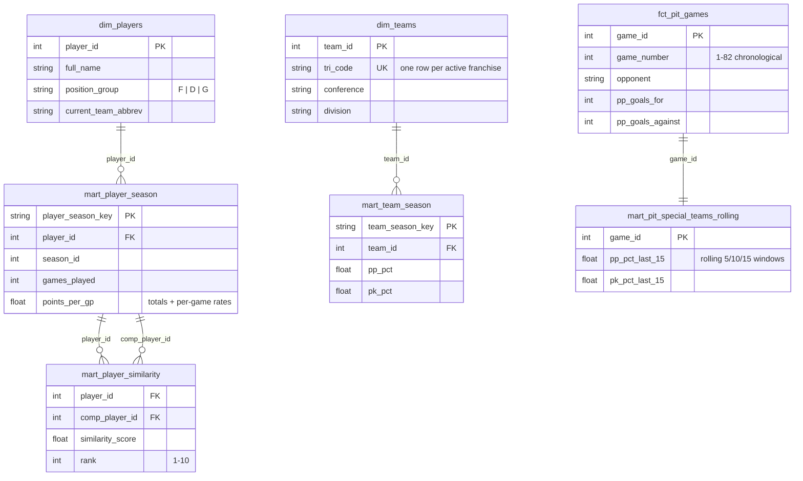

# Architecture

Companion to the [README](../README.md): verified API endpoints, the warehouse data model, and the design decisions behind the agent and similarity engine.

## Verified NHL API endpoints (recon date: 2026-07-05)

All endpoints below were verified empirically with curl. Raw samples live in `ingestion/cache/samples/` (gitignored). The API is undocumented and may change; shapes documented here reflect what was actually returned.

### Base: `https://api-web.nhle.com/v1`

| Endpoint | Status | Notes |
|---|---|---|
| `/standings/now` | 200 via 307 redirect | Redirects to `/standings/{last-standings-date}` (e.g. `/standings/2026-04-17` in the offseason). **Clients must follow redirects.** Returns `{wildCardIndicator, standingsDateTimeUtc, standings: [32 rows]}` with ~80 fields per team (wins/losses/points, home/road/L10 splits, division/conference sequences). |
| `/club-schedule-season/PIT/20252026` | 200 | `{previousSeason, currentSeason, nextSeason, clubTimezone, clubUTCOffset, games: [95]}`. 82 games with `gameType=2` (regular season), all `gameState=OFF` (final). Each game: `id`, `gameDate`, `season`, `homeTeam`/`awayTeam` (with `id`, `abbrev`, `score`), `gameOutcome`, `venue`, `startTimeUTC`. |
| `/gamecenter/{gameId}/boxscore` | 200 | Game header (`id`, `season`, `gameDate`, `gameState`, `gameOutcome`) + `homeTeam`/`awayTeam` (**only `score` and `sog` at team level**) + `playerByGameStats` (per-player: goals, assists, points, plusMinus, pim, hits, blockedShots, powerPlayGoals, sog, faceoffWinningPctg, toi). |
| `/gamecenter/{gameId}/right-rail` | 200 | **Required for team-level game stats.** The boxscore does not carry them. `teamGameStats` is a category list with `awayValue`/`homeValue`: `sog`, `faceoffWinningPctg`, `powerPlay` (as `"G/OPP"` string, e.g. `"0/2"`), `powerPlayPctg`, `pim`, `hits`, `blockedShots`, `giveaways`, `takeaways`. Also has `linescore` and `shotsByPeriod`. |
| `/player/{playerId}/landing` | 200 | Bio (`firstName.default`, `lastName.default`, `position`, `currentTeamAbbrev`, height/weight, `birthDate`, `shootsCatches`), `careerTotals`, `seasonTotals`, `draftDetails`. |

### Stats REST base: `https://api.nhle.com/stats/rest/en`

Query pattern: `?limit=-1&cayenneExp=seasonId=20252026 and gameTypeId=2` (URL-encode spaces). Response shape: `{data: [...], total: N}`.

| Endpoint | 2025-26 rows | Notes |
|---|---|---|
| `/skater/summary` | 940 | goals, assists, points, shots, shootingPct, plusMinus, penaltyMinutes, ppGoals, ppPoints, shGoals, shPoints, evGoals/evPoints, gameWinningGoals, faceoffWinPct, timeOnIcePerGame (seconds), positionCode, teamAbbrevs, gamesPlayed. **No hits or blocks.** |
| `/skater/realtime` | 940 | Fills the summary gap: `hits`, `blockedShots`, `giveaways`, `takeaways`, plus per-60 rates. Same key (`playerId`, `seasonId`); joined to summary in staging. |
| `/goalie/summary` | 98 | wins/losses/otLosses, gamesStarted, savePct, goalsAgainstAverage, saves, shotsAgainst, shutouts, timeOnIce. |
| `/team/summary` | 32 | goalsFor/AgainstPerGame, powerPlayPct, penaltyKillPct (+ net variants), faceoffWinPct, pointPct, shots for/against per game. |
| `/team` | 62 | Team reference (id, fullName, triCode). Includes historical franchises; filter to the 32 active via join to `/team/summary`. |

## Per-game PIT ingestion mapping (feeds `fct_pit_games`)

For each of the 82 regular-season games: schedule row gives date, opponent, home/away, scores, result; `right-rail.teamGameStats` gives PP conversion for both sides. For PIT specifically:

- `pp_goals_for` / `pp_opportunities`: parse PIT side's `powerPlay` string `"G/OPP"`.
- `pp_goals_against` / `times_shorthanded`: parse the opponent side's `powerPlay` string.
- `shots_for` / `shots_against`: `sog` categories by side.
- PK% per game = 1 - (pp_goals_against / times_shorthanded).

Boxscore is ingested alongside right-rail for game state/outcome confirmation and player-level game stats (future extension).

## Data model

Grain decisions worth noting:

- **`dim_teams` is one row per active franchise (tricode), not per teamId.** The NHL mints a new `teamId` on rebrand (Utah Hockey Club id 59 became Utah Mammoth id 68, both `UTA`), so a teamId grain double-counts franchises. The dbt `unique tri_code` test caught this. Historical seasons resolve tricodes through the full team reference so 2024-25 Utah still maps to `UTA`.
- **Nested game payloads land as raw JSON strings** (`payload` column keyed by `game_id`) rather than autodetected RECORDs. Game objects vary field-by-field (overtime fields, winning goalie, etc.), which makes schema autodetection fragile across loads; staging parses them deterministically with `JSON_VALUE` and `JSON_EXTRACT_ARRAY`.
- **Raw loads are WRITE_TRUNCATE with a `_loaded_at` stamp**, and staging still dedupes on natural keys defensively, so a partial or repeated load cannot create duplicate rows downstream.

## Agent design

**Why text-to-SQL instead of embeddings:** the warehouse is small, relational, and precisely aggregable. Questions like "PK% over the last 15 games" have exact answers that vector similarity cannot produce. The agent's value is translation plus transparency: the UI shows every query it ran.

**System prompt.** Built from `web/lib/schema.ts`: every mart table with columns, types, and one-line descriptions, four example question-to-SQL pairs, and behavioral rules (default season, PIT-only game grain, percentage formatting, admit when a question is unanswerable).

**Tool loop.** One tool, `run_sql(query)`. The route runs a manual tool-use loop (max 8 turns): validate the SQL, execute on BigQuery, return rows as JSON in the tool result. On validation or BigQuery errors the message goes back as an `is_error` tool result and Claude retries, with a hard budget of 3 failed queries; the final failure message instructs it to stop querying and answer with what it has.

**Guardrails (defense in depth):**

| Layer | Control |
|---|---|
| Validation | single statement, starts with SELECT or WITH, no semicolons, DDL/DML keyword blocklist |
| Dataset scope | must reference `nhl_marts.`; `nhl_raw`, `nhl_stg`, `INFORMATION_SCHEMA` rejected |
| Cost/latency | `LIMIT 200` injected when absent, 15s job timeout, `maximumBytesBilled` cap |
| Credentials | service account has only BigQuery Data Editor + Job User; keys live in server-side env |
| Injection | user text never interpolated into SQL; UI lookups use BigQuery query parameters |

The comps typeahead is served by one cached endpoint returning all eligible players, filtered client-side, so autocompletion costs zero warehouse queries per keystroke; selections look up by `player_id` (two Sebastian Ahos exist).

## Similarity methodology

- Pool: 2025-26 skaters with >= 20 GP (715 players), split into forwards (476) and defensemen (239); goalies excluded. Comps never cross position groups.
- Features: per-game rates for counting stats (goals, assists, points, shots, PP points, hits, blocks, PIM, plus-minus) plus shooting % and TOI/GP. Forwards additionally use faceoff %; nulls (wingers who never take draws) are mean-imputed, which is neutral after z-scoring.
- Method: z-score normalize per pool, cosine similarity, keep top 10 per player. Written back to `nhl_marts.mart_player_similarity` (7,150 rows) with WRITE_TRUNCATE.
- Sanity checks that came back clean: McDavid's #1 comp is Draisaitl (0.979); comp lists are near-symmetric (Crosby #1 for Stützle, Stützle #2 for Crosby); Makar comps to PP-quarterback defensemen (Bouchard, Carlson, Werenski).

## Orchestration

`airflow/dags/nhl_daily_ingest.py` documents the production shape (demonstration artifact, not deployed): parallel ingest branches (league stats REST, PIT gamecenter) fan into the BigQuery load, then `dbt run >> dbt test >> compute_similarity`, with dbt tests acting as a quality gate before the similarity mart rebuilds. Daily at 6am ET, retries=2 on top of the ingest client's own per-request retries, `catchup=False` because each run is a full refresh of current-season data.
