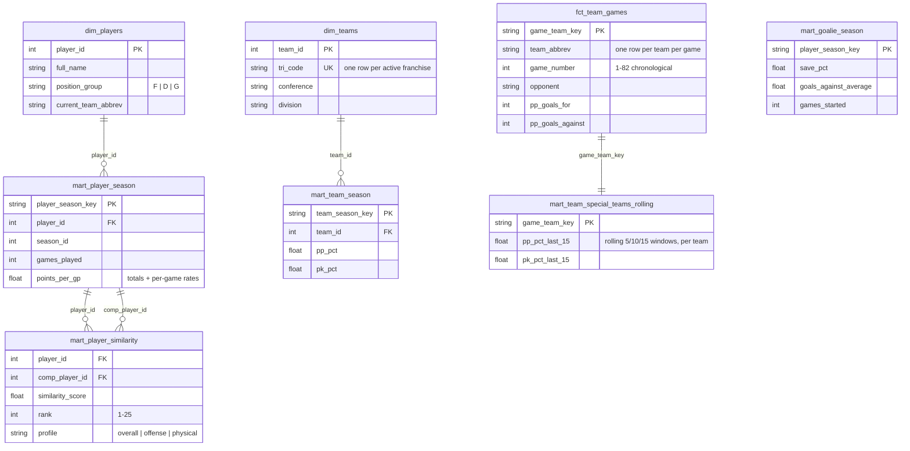

# Architecture

Companion to the [README](../README.md): verified API endpoints, the warehouse data model, and the design decisions behind the agent and similarity engine.

## Verified NHL API endpoints (recon date: 2026-07-05)

All endpoints below were verified empirically with curl. Raw samples live in `ingestion/cache/samples/` (gitignored). The API is undocumented and may change; shapes documented here reflect what was actually returned.

### Base: `https://api-web.nhle.com/v1`

| Endpoint | Status | Notes |
|---|---|---|
| `/standings/now` | 200 via 307 redirect | Redirects to `/standings/{last-standings-date}` (e.g. `/standings/2026-04-17` in the offseason). **Clients must follow redirects.** Returns `{wildCardIndicator, standingsDateTimeUtc, standings: [32 rows]}` with ~80 fields per team (wins/losses/points, home/road/L10 splits, division/conference sequences). |
| `/club-schedule-season/PIT/20252026` | 200 | `{previousSeason, currentSeason, nextSeason, clubTimezone, clubUTCOffset, games: [95]}`. 82 games with `gameType=2` (regular season), all `gameState=OFF` (final). Each game: `id`, `gameDate`, `season`, `homeTeam`/`awayTeam` (with `id`, `abbrev`, `score`), `gameOutcome`, `venue`, `startTimeUTC`. |
| `/gamecenter/{gameId}/boxscore` | 200 | Game header (`id`, `season`, `gameDate`, `gameState`, `gameOutcome`) + `homeTeam`/`awayTeam` (**only `score` and `sog` at team level**) + `playerByGameStats` (per-player: goals, assists, points, plusMinus, pim, hits, blockedShots, powerPlayGoals, sog, faceoffWinningPctg, toi). |
| `/gamecenter/{gameId}/right-rail` | 200 | **Required for team-level game stats.** The boxscore does not carry them. `teamGameStats` is a category list with `awayValue`/`homeValue`: `sog`, `faceoffWinningPctg`, `powerPlay` (as `"G/OPP"` string, e.g. `"0/2"`), `powerPlayPctg`, `pim`, `hits`, `blockedShots`, `giveaways`, `takeaways`. Also has `linescore` and `shotsByPeriod`. |
| `/player/{playerId}/landing` | 200 | Bio (`firstName.default`, `lastName.default`, `position`, `currentTeamAbbrev`, height/weight, `birthDate`, `shootsCatches`), `careerTotals`, `seasonTotals`, `draftDetails`. |
| `/gamecenter/{gameId}/play-by-play` | 200 | `plays[]` event stream (~300/game). Shot events (`goal`, `shot-on-goal`, `missed-shot`, `blocked-shot`) carry `details` with `xCoord`/`yCoord` (nets at x = +/-89), `shotType`, `zoneCode`, `shootingPlayerId`, `goalieInNetId`, `eventOwnerTeamId`, plus `situationCode` (goalie/skater counts) and `homeTeamDefendingSide` (resolves attack direction). Blocked shots are owned by the BLOCKING team. Feeds the xG model. |

### Stats REST base: `https://api.nhle.com/stats/rest/en`

Query pattern: `?limit=-1&cayenneExp=seasonId=20252026 and gameTypeId=2` (URL-encode spaces). Response shape: `{data: [...], total: N}`.

| Endpoint | 2025-26 rows | Notes |
|---|---|---|
| `/skater/summary` | 940 | goals, assists, points, shots, shootingPct, plusMinus, penaltyMinutes, ppGoals, ppPoints, shGoals, shPoints, evGoals/evPoints, gameWinningGoals, faceoffWinPct, timeOnIcePerGame (seconds), positionCode, teamAbbrevs, gamesPlayed. **No hits or blocks.** |
| `/skater/realtime` | 940 | Fills the summary gap: `hits`, `blockedShots`, `giveaways`, `takeaways`, plus per-60 rates. Same key (`playerId`, `seasonId`); joined to summary in staging. |
| `/skater/timeonice` | 940 | Ice time by strength state (`evTimeOnIce`, `ppTimeOnIce`, `shTimeOnIce`, total; seconds). Required for honest strength-state per-60 rates; the summary report carries only all-strengths TOI. |
| `/skater/bios` | 940 | `birthDate`, draft year/round/overall, height/weight, nationality. Age context for similarity comps. |
| `/goalie/bios` | 98 | Same bio fields for goalies. |
| `/goalie/summary` | 98 | wins/losses/otLosses, gamesStarted, savePct, goalsAgainstAverage, saves, shotsAgainst, shutouts, timeOnIce. |
| `/team/summary` | 32 | goalsFor/AgainstPerGame, powerPlayPct, penaltyKillPct (+ net variants), faceoffWinPct, pointPct, shots for/against per game. |
| `/team` | 62 | Team reference (id, fullName, triCode). Includes historical franchises; filter to the 32 active via join to `/team/summary`. |

## Per-game ingestion mapping (feeds `fct_team_games`)

League-wide for 2025-26: every team's schedule is pulled and deduped to the 1,312 unique games (each game appears on two schedules), then one right-rail per game. Schedule rows give date, home/away, scores, result; `right-rail.teamGameStats` gives PP conversion for both sides:

- `pp_goals_for` / `pp_opportunities`: parse that team's side of the `powerPlay` string `"G/OPP"`.
- `pp_goals_against` / `times_shorthanded`: parse the opponent side's `powerPlay` string.
- `shots_for` / `shots_against`: `sog` categories by side.
- PK% per game = 1 - (pp_goals_against / times_shorthanded).

Each game unions into two team-perspective rows (2,624 total). PIT boxscores are additionally ingested for player-level game stats (future player-game mart).

## Data model

Grain decisions worth noting:

- **`dim_teams` is one row per active franchise (tricode), not per teamId.** The NHL mints a new `teamId` on rebrand (Utah Hockey Club id 59 became Utah Mammoth id 68, both `UTA`), so a teamId grain double-counts franchises. The dbt `unique tri_code` test caught this. Historical seasons resolve tricodes through the full team reference so 2024-25 Utah still maps to `UTA`.
- **Nested game payloads land as raw JSON strings** (`payload` column keyed by `game_id`) rather than autodetected RECORDs. Game objects vary field-by-field (overtime fields, winning goalie, etc.), which makes schema autodetection fragile across loads; staging parses them deterministically with `JSON_VALUE` and `JSON_EXTRACT_ARRAY`.
- **Raw loads are WRITE_TRUNCATE with a `_loaded_at` stamp**, and staging still dedupes on natural keys defensively, so a partial or repeated load cannot create duplicate rows downstream.

## Agent design

**Why text-to-SQL instead of embeddings:** the warehouse is small, relational, and precisely aggregable. Questions like "PK% over the last 15 games" have exact answers that vector similarity cannot produce. The agent's value is translation plus transparency: the UI shows every query it ran.

**System prompt.** Built from `web/lib/schema.ts`: every mart table with columns, types, and one-line descriptions, example question-to-SQL pairs, behavioral rules (default season, percentage formatting, multi-turn pronoun resolution), and an explicit "Hard limits" section listing what the warehouse cannot answer (playoffs, xG, player game logs, short-handed per-60).

**The hard-limits section exists because of a caught failure.** In review, the agent was asked for even-strength points per 60; the warehouse then had only all-strengths TOI, and the agent silently divided EV points by total ice time, producing a confident, mislabeled statistic. The fix was two-layered: ingest the timeonice report so EV/PP per-60 columns actually exist (computed against the correct strength-state TOI in dbt), and instruct the agent that per-60 rates must come from those columns, never derived from `toi_minutes_per_gp`. Both layers are pinned by eval cases (`ev_points_per_60_honest`, `sh_per60_decline`). The general lesson: a text-to-SQL agent is only as honest as its schema documentation, and every semantic boundary in the data needs to be stated, not assumed.

**Tool loop.** One tool, `run_sql(query)`. The route runs a manual tool-use loop (max 8 turns), accepts prior conversation turns for follow-up questions, and streams over SSE: text deltas as Claude writes, status events while queries execute, and a final event carrying the executed SQL and last result set. On validation or BigQuery errors the message goes back as an `is_error` tool result and Claude retries, with a hard budget of 3 failed queries; the final failure message instructs it to stop querying and answer with what it has.

**Operations.** Every interaction is logged to `nhl_ops.agent_interactions` (question, SQL, row count, latency, status) via a batch load job (the BigQuery sandbox rejects streaming inserts and DML; load jobs are free). The log is the eval-mining and cost-tracking surface. Per-IP sliding-window rate limits in `web/middleware.ts` cap the endpoints that spend Claude tokens or BigQuery jobs; the golden-set eval harness (`evals/`) replays 14 assertion-checked questions against any deployment and exits non-zero on failure.

**Guardrails (defense in depth):**

| Layer | Control |
|---|---|
| Validation | single statement, starts with SELECT or WITH, no semicolons, DDL/DML keyword blocklist |
| Dataset scope | must reference `nhl_marts.`; `nhl_raw`, `nhl_stg`, `INFORMATION_SCHEMA` rejected |
| Cost/latency | `LIMIT 200` injected when absent, 15s job timeout, `maximumBytesBilled` cap |
| Credentials | service account has only BigQuery Data Editor + Job User; keys live in server-side env |
| Injection | user text never interpolated into SQL; UI lookups use BigQuery query parameters |

The comps typeahead is served by one cached endpoint returning all eligible players, filtered client-side, so autocompletion costs zero warehouse queries per keystroke; selections look up by `player_id` (two Sebastian Ahos exist).

## Historical coverage and era honesty

Season-level reports are ingested for every NHL season, 1917-18 through 2025-26 (the 2004-05 lockout returns zero rows and is skipped naturally). Two data-quality traps came with the century of history:

- **False zeros.** The realtime report returns 0 hits/blocks for every skater in pre-tracking eras rather than nulls. Staging nulls any stat whose league-wide season total is zero, a data-driven rule that needs no hardcoded era table. Career aggregates therefore skip untracked seasons instead of summing fabricated zeros.
- **Autodetect drift.** With 1917-era rows (all nulls) leading the load files, BigQuery autodetected TOI and faceoff columns as STRING. Staging now SAFE_CASTs every drift-prone numeric column.
- **Era-scoped tests.** not_null tests on save_pct / pp_pct / pk_pct are scoped to the seasons where the stat was tracked (and to goalies who actually faced a shot; the league has a dozen cup-of-coffee goalies with 0 shots against, including the Hurricanes' emergency equipment-manager goalie).

Career marts (`mart_player_career`, `mart_goalie_career`) validate exactly against the record book: Gretzky 2,857 points / 894 goals / 1,487 games, Howe 801 goals, Brodeur 691 wins / 125 shutouts, and the real all-time top three goal seasons (92, 87, 86).

## Playoffs

Playoff (gameTypeId=3) data mirrors the regular-season architecture at every grain: season-level reports across all history (21,312 playoff skater-seasons), career playoff marts, and full 2025-26 playoff game/player-game/shot coverage (82 games). Design decisions:

- **Strict separation.** Playoff tables are parallel marts (`mart_player_playoff_*`, `fct_team_playoff_games`, ...) rather than a game_type column on regular-season marts, so existing guarantees (82-game tests, xG calibration, career totals matching the record book) are untouched and the agent can never silently mix the two populations.
- **Bracket decoding.** The playoff game id encodes round/series/game (2025030415 = round 4, series 1, game 5), so the Stanley Cup champion is derivable: winner of the latest round-4 game (2026: Carolina over Vegas in 6).
- **xG out-of-sample.** The xG model trains on regular-season shots only and scores playoff attempts out-of-sample; season xG aggregates and the calibration gate stay scoped to the training domain.
- Validated against the record book: Gretzky 382 playoff points / 122 goals, Roy 151 playoff wins, all exact.

## Expected goals model

- **Data**: ~160K shot attempts parsed from play-by-play at ingest time (rebound/rush flags need event ordering, which is awkward to reconstruct in SQL, so flattening happens in Python where the sequence exists). Attack direction resolves exactly from `homeTeamDefendingSide` + shooter side, so distance/angle are correct in all zones, not just offensive-zone shots.
- **Model**: logistic regression, trained on unblocked attempts with a goalie in net. Features: distance, angle, one-hot shot type, is_rebound, is_rush, one-hot strength state. Blocked shots (coordinates record the block, not the shot origin) and empty-net attempts are excluded and carry null xg.
- **Validation**: holdout AUC and calibration print at training time; a tagged dbt test (`assert_xg_calibrated`) fails the pipeline if league predicted goals drift more than 5% from actual. The two-stage dbt build (`--exclude tag:xg`, then `--select tag:xg` after scoring) keeps the aggregate marts from ever building on a stale shots table.
- **Honesty**: the schema doc tells the agent to describe this as "expected goals from shot location and type"; screens, pre-shot movement, and shooter skill are exactly what proprietary models add on top.

## Visuals

All charts are dependency-free SVG components (`web/lib/charts.tsx`):

- **Leaderboards** (`/leaders`, `/api/leaders`): seven bar-chart sections straight from the marts, edge-cached daily.
- **Agent auto-charts**: a heuristic on the result set (sequential x column like game_number/game_date = line chart; a mostly-unique label column with <= 40 rows = bar chart) renders above the data table with a metric picker. No chart appears when the heuristic is unsure, so the feature never mislabels data.
- **Percentile radar** (comps page): player-vs-comp overlay of the league percentile columns, the scouting-card view of the same numbers in the stat table.
- **Shot maps** (comps page, `/api/shots`): half-rink scatter of every model-eligible attempt, marker area scaled by xG, goals in amber. Coordinates normalize to attack right; defensive-zone attempts (~0.5%, unmappable mirror) are excluded and the footnote says so.
- **Rolling form** (`mart_player_form`): each skater-game row carries last-10 points/goals/shots, rolling xG, finishing vs expected, and form_delta vs their own season baseline, so "who is hot" decomposes into shooting more vs finishing above expected.

## Similarity methodology (v2)

- Pools: 2025-26 skaters with >= 20 GP split into forwards (476) and defensemen (239), plus goalies with >= 15 GP (70). Comps never cross position groups.
- Skater features: per-60 rates against the correct strength-state ice time (goals, assists, shots, hits, blocks against all-strengths TOI; EV points/goals against EV TOI; PP points against PP TOI) plus shooting %, TOI/GP as a usage signal, PIM and plus-minus per game. Points is excluded: it is goals + assists, and keeping it double-weights scoring. Forwards additionally use faceoff %; nulls (wingers who never take draws) are mean-imputed, which is neutral after z-scoring.
- Goalie features: save %, GAA, starts (workload), win % per start, shots against per start, shutout rate.
- Two-season blending: each season's pool is z-scored independently, then a player's vector is 75% current season + 25% prior season when a qualifying prior season exists, damping single-season outliers.
- Weight profiles: cosine similarity runs on weight-scaled vectors (features scaled by sqrt(weight)) for three skater profiles: overall (uniform), offense (physical stats down-weighted to 0.25), physical (offensive stats down-weighted to 0.25). A scout picks the profile in the UI.
- Top 25 comps stored per player per profile (55k rows, WRITE_TRUNCATE); the UI shows 10 after optional age-band filtering (age comes from the bios report and is displayed, deliberately not used as a similarity feature).
- Sanity checks that came back clean: Makar comps to PP-quarterback defensemen (Bouchard #1), Hellebuyck comps to high-workload starters (Shesterkin #1), and comp lists remain near-symmetric.

## Orchestration

`airflow/dags/nhl_daily_ingest.py` documents the production shape (demonstration artifact, not deployed): three parallel ingest branches (season-level stats REST, league-wide gamecenter pulls, PIT boxscores) fan into the BigQuery load, then `dbt run >> dbt test >> compute_similarity`, with dbt tests acting as a quality gate before the similarity mart rebuilds. Daily at 6am ET, retries=2 on top of the ingest client's own per-request retries, `catchup=False` because each run is a full refresh of current-season data.
